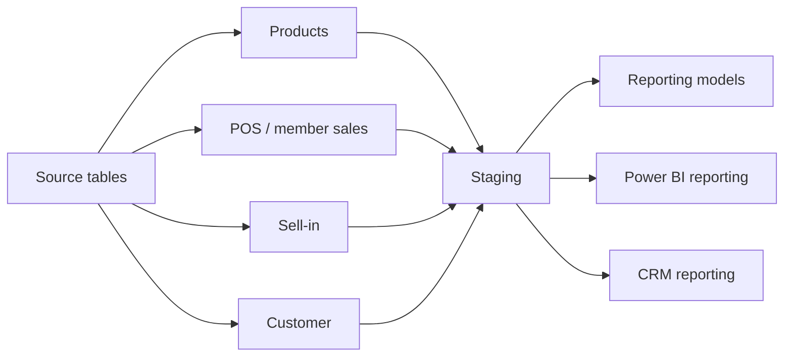

# Dataform Showcase: Product, POS, Sell-In, and Customer Pipelines

This repository is a curated Dataform project that demonstrates how I design trusted analytics pipelines for both stakeholder review and portfolio presentation. The solution follows a clear source-to-staging-to-reporting pattern and centers on the domains most useful for an executive or hiring-manager walkthrough: products, POS, sell-in, and customer data.

## Table of contents
- [Scope](#scope)
- [Architecture](#architecture)
- [Preserved showcase set](#preserved-showcase-set)
  - [Products](#products)
  - [POS](#pos)
  - [Sell-in](#sell-in)
  - [Customer](#customer)
- [Extended context retained for realism](#extended-context-retained-for-realism)
  - [Money manager](#money-manager)
  - [Profitability](#profitability)
  - [Operations](#operations)
- [Repository structure](#repository-structure)
- [Why this structure works](#why-this-structure-works)

## Scope
This showcase focuses on four core business areas:

- Products
- POS and member sales exceptions
- Sell-in
- Customer

These areas are the clearest expression of the project’s architecture, decision-making, and business understanding. The repo also keeps a small amount of operational and finance context so the project reads as realistic and production-minded, while the main showcase remains easy to explain.

## Architecture

The model design prioritizes trustworthy intermediate tables, clear lineage, and reporting outputs that are easy to explain and review. This pattern shows strong data engineering judgment without becoming overly complex.

## Preserved showcase set

### Products
- [definitions/sources/data_warehouse_products/src-d_w_p-products.sqlx](definitions/sources/data_warehouse_products/src-d_w_p-products.sqlx)
- [definitions/staging/source_of_truth/s_o_t-products.sqlx](definitions/staging/source_of_truth/s_o_t-products.sqlx)
- [definitions/reporting/power_bi/p_bi-rebates.sqlx](definitions/reporting/power_bi/p_bi-rebates.sqlx)

### POS
- [definitions/sources/data_warehouse/src-d_w-pos_missing_days.sqlx](definitions/sources/data_warehouse/src-d_w-pos_missing_days.sqlx)
- [definitions/staging/source_of_truth/s_o_t-pos_incl_excep.sqlx](definitions/staging/source_of_truth/s_o_t-pos_incl_excep.sqlx)
- [definitions/reporting/power_bi/p_bi-pos_incl_excep.sqlx](definitions/reporting/power_bi/p_bi-pos_incl_excep.sqlx)
- [definitions/reporting/power_bi/p_bi-rebates_with_pos.sqlx](definitions/reporting/power_bi/p_bi-rebates_with_pos.sqlx)

### Sell-in
- [definitions/sources/data_warehouse/src-d_w-sell_in_unauthorized_accounts.sqlx](definitions/sources/data_warehouse/src-d_w-sell_in_unauthorized_accounts.sqlx)
- [definitions/staging/source_of_truth/s_o_t-sell_in.sqlx](definitions/staging/source_of_truth/s_o_t-sell_in.sqlx)
- [definitions/reporting/power_bi/p_bi-sell_in.sqlx](definitions/reporting/power_bi/p_bi-sell_in.sqlx)

### Customer
- [definitions/staging/source_of_truth_netsuite/s_o_t_n-customer.sqlx](definitions/staging/source_of_truth_netsuite/s_o_t_n-customer.sqlx)
- [definitions/reporting/crm/p_bi-customer.sqlx](definitions/reporting/crm/p_bi-customer.sqlx)
- [definitions/reporting/crm/p_bi-customer_membership_reporting.sqlx](definitions/reporting/crm/p_bi-customer_membership_reporting.sqlx)

## Extended context retained for realism
These areas are intentionally kept in the project to show broader operational depth and real-world context, even though they are not the primary public-facing story.

### Money manager
The money manager layer supports finance reconciliation and invoice-payment analysis. It sits under [definitions/reporting/money_manager](definitions/reporting/money_manager) and demonstrates a strong understanding of how financial data can be modeled with consistent source-to-reporting lineage.

### Profitability
The profitability work in [definitions/staging/profitability](definitions/staging/profitability) shows reusable building blocks for business-unit and customer-level profitability analysis. This area reinforces the repo’s focus on composable, maintainable logic rather than one-off transformation logic.

### Operations
The operational layer under [definitions/operations](definitions/operations) includes snapshot and validation support, recovery patterns, and data-quality safeguards. It is important because mature analytics engineering is not only about delivering reports; it is about protecting trust in the data.

## Repository structure
- [definitions/sources](definitions/sources): source and lightly shaped source tables
- [definitions/staging](definitions/staging): standardized and trusted staging models
- [definitions/reporting](definitions/reporting): curated analytics outputs for BI and stakeholder consumption
- [definitions/operations](definitions/operations): validation, snapshots, and recovery assets
- [documentation](documentation): architecture, lineage, style, and governance notes
- [includes](includes): reusable helper logic and project utilities
- [build_showcase.py](build_showcase.py): portfolio build and showcase helper

## Why this structure works
This project reflects a practical analytics engineering pattern:

- source tables remain close to the raw system boundary
- staging models normalize, deduplicate, and standardize logic
- reporting models produce outputs that are easier to consume and explain
- operational assets protect the trust and resilience of the overall data product

That balance makes the repository easier to explain, easier to maintain, and stronger in a hiring or stakeholder review.

The project is configured for BigQuery and uses the Dataform core dependency defined in [package.json](package.json) and the warehouse settings in [dataform.json](dataform.json).
